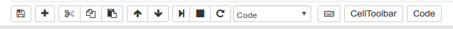

# Hydrogen Test

- Repository built for Tony Zeng for a job posted in CodeMentor.io
- MyBinder.org is used to deploy Jupyter notebooks that serve as demos

## Instructions

1. Develop your Jupyter notebook
2. Prepare notebook interactivity for demo
3. Send your notebook to a GitHub repository
4. Deploy notebook to MyBinder.org
5. Share your demo

### 1. Develop your Jupyter notebook

This step is the same as always. Just develop your code normally.

### 2. Prepare notebook interactivity for demo

1. Install Plotly JavaScript connection for browser

```
npm install plotly-notebook-js
```

This should create a `node_modules/` directory in the root directory for the project that contains the `plotly-notebook-js` files.

2. To execute all the cells in the notebook paste the following code int he first cell (remember it must be the first cell):

```
%%html
<script>
    //
    // Run all notebook cells on load
    //
    // 1. Finish updating the code
    // 2. Run this cell with CTRL-ENTER
    // 3. Save the notebook
    // 4. Commit the code to Git
    //
    // If you change the code afterwards, this
    // will not work. It must be the last thing
    // you do before you distribute changes.
    //
    // Omar Trejo <otrenav@gmail.com>
    //
    require(
        ['base/js/namespace', 'jquery'],
        function(jupyter, $) {
            $(jupyter.events).on("kernel_ready.Kernel", function () {
                console.log("Auto-running all cells-below...");
                jupyter.actions.call('jupyter-notebook:run-all-cells-below');
                jupyter.actions.call('jupyter-notebook:save-notebook');
            });
        }
    );
</script>
```

3. To hide the code for viewers paste the following code in the second cell:

```
%%html
<script>
    //
    // Hide all input cells
    //
    // A button will be created in the toolbar which
    // says "Code" (you can change it in the following
    // lines). If you click it, you will show the
    // input cells.
    //
    // Omar Trejo <otrenav@gmail.com>
    //
    var showCode = true;
    var toggleCode = function() {
        if (showCode) {
            $('div.input').hide();
        } else {
            $('div.input').show();
        }
        showCode = !showCode;
    };
    var toggleCodeButton = (
        '<div class="btn-group" id="buttonOne">' +
        '<button class="btn btn-default" onclick="toggleCode()">' +
        'Code' +
        '</button>' +
        '</div>'
    );
    if (!document.getElementById("buttonOne")) {
        $("#maintoolbar-container").append(toggleCodeButton);
    }
    $(document).ready(toggleCode);
</script>
```

It should show a button in the right side of the toolbar like the one in the image:



4. To hide the toolbar for viewers paste the following code in the third cell:

```
%%html
<script>
    //
    // Hide toolbars
    //
    // A button will be created in the top bar which
    // says "Toolbars" (you can change it in the
    // following lines). If you click it, you will
    // show the toolbars.
    //
    // Omar Trejo <otrenav@gmail.com>
    //
    var showToolbars = true;
    var toggleToolbars = function() {
        if (showToolbars) {
            $("div#menubar-container").hide();
        } else {
            $("div#menubar-container").show();
        }
        showToolbars = !showToolbars;
    };
    toggleToolbarsButton = (
        '&nbsp; &nbsp; &nbsp;' +
        '<div class="btn-group" id="buttonTwo">' +
        '<button class="btn btn-default" onclick="toggleToolbars()">' +
        'Toolbars' +
        '</button>' +
        '</div>'
    );
    if (!document.getElementById("buttonTwo")) {
        $("#header-container").append(toggleToolbarsButton);
    }
    $(document).ready(toggleToolbars);
</script>
```

It should show a button in the right side of the header like the one in the image:


5. To avoid synchronization issues due to the `auto-save` functionality that cause messages to be showed to users stating that the notebook has changed and that they should reload, paste the following code in the last cell:

```
%autosave 0
```

### 3. Send your notebook to a GitHub repository

The first time you are going to setup a project/demo, you should do the following:

1. Create a repository in GitHub for this new project
   - Instead of creating a new one, you can fork this one
   - This needs to be done only once per project/demo
2. Clone the repository to your computer (`git clone <URL>`)
3. Put the files you created inside
   - If you forked this repository, modify the files instead

Now you are able to make changes, commit them to the repository, and push them to GitHub for them to be visible to MyBinder.org. Everytime you want to make changes for the deployment you should do the following:

1. Add all the changes: `git add -A`
2. Commit with a message: `git commit -m "Your message here..."`
3. Push changes to GitHub: `git push`

After these commands, you should be able to so the changes in the GitHub repository. If you can, you are ready to deploy to MyBinder.org.

### 4. Deploy notebook to MyBinder.org

1. Copy the URL of your GitHub repository
2. Go to [MyBinder.org](http://www.mybinder.org)
2. Paste the URL in the "Build repository" text box
3. Click submit button (this will take you to a Docker build page)
4. Wait for the three circles to be green (completed)
5. Click on the "launch binder" button on the right side

At this point your deploy should be loading for the first time (`matplotlib` willl create some fonts for you and display a message). It may take a couple of minutes for this first time to load completely and some filters/sliders may not show correctly. Once it has finished, you can reload the site and get the normal experience from then on.

### 5. Share your demo

1. Copy the URL for the demo
2. Share the URL with whoever you want to view the demo

## Questions

If you get any questions, feel free to contact me through CodeMentor. If it's a mistake/bug on my part, I'll be happy to fix it.

## Resources

If you are new to Git and GitHub in general, you can check the following resources to get started:

- https://www.atlassian.com/git/tutorials/
- https://git-scm.com/book/en/v2
- https://try.github.io/levels/1/challenges/1
- https://www.codecademy.com/learn/learn-git
